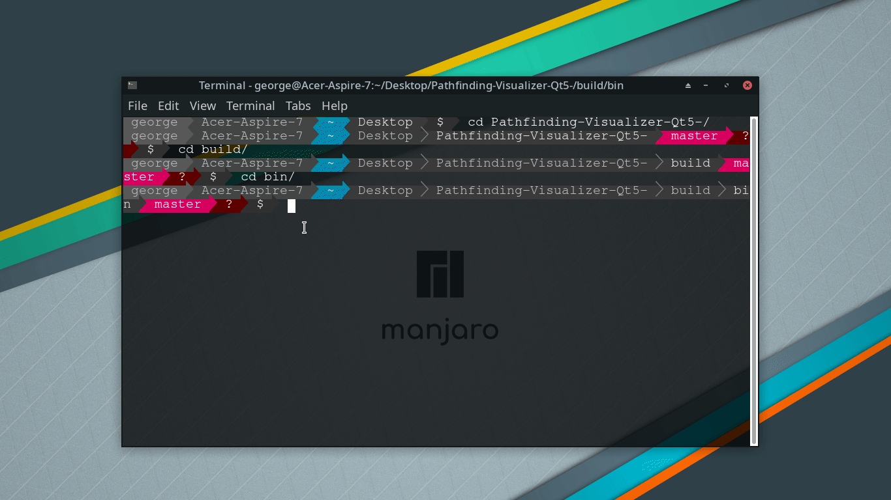

# Pathfinding-Visualizer-Qt5-
[](https://www.codacy.com/gh/ggiap/Pathfinding-Visualizer-Qt5-/dashboard?utm_source=github.com&amp;utm_medium=referral&amp;utm_content=ggiap/Pathfinding-Visualizer-Qt5-&amp;utm_campaign=Badge_Grade)

Visualization of how 3 pathfinding algorithms work(and one more random search algorithm for testing purposes). Diagonal movement is supported.

Currently supported algorithms:
* [A*](https://en.wikipedia.org/wiki/A*_search_algorithm)
* [GreedyBFS](https://en.wikipedia.org/wiki/Best-first_search)
* [Dijkstra](https://en.wikipedia.org/wiki/Dijkstra%27s_algorithm)

Distance calculation: 
* [Manhattan distance](https://en.wikipedia.org/wiki/Taxicab_geometry)
* [Chebysev distance](https://en.wikipedia.org/wiki/Chebyshev_distance)
* [Euclidean distance](https://en.wikipedia.org/wiki/Euclidean_distance)

You can also load a map from a file, check [Grids for testing](https://github.com/ggiap/Pathfinding-Visualizer-Qt5-/tree/master/Grids_for_testing) folder for reference on how to create them. Furthermore, obstacles can be added on the cells you don't want the algorithm to pass through.

## Built With

* [SFML](https://www.sfml-dev.org/) - The framework used for rendering
* [CMake](https://cmake.org/) - Build System
* [Qt5](https://www.qt.io/) - Used to create the form
* [conan](https://conan.io/) - Open source package manager/dependency manager

## Prerequisites

### $Windows
Check my [.NET forms application](https://github.com/ggiap/Pathfinding-Visualizer-.NET-Forms-) for the windows version.


### $Manjaro

#### pip
```
sudo pacman -Syu python-pip
```

#### conan
```
pip install conan
```

#### Qt
```
sudo pacman -Syu qt5
```

#### CMake
```
sudo pacman -Syu cmake
```

## Installing

### Clone the repo
```
git clone https://github.com/ggiap/Pathfinding-Visualizer-Qt5-.git
```

### Create a build folder

```
cd Pathfinding-Visualizer-Qt5-
mkdir build
cd build
```

### Build the executable

##### Debug build
```
cmake -DCMAKE_BUILD_TYPE=Debug .. && make
```

##### Release build
```
cmake -DCMAKE_BUILD_TYPE=Release .. && make
```

##### Run
```
cd bin && ./PathfindingVisualization
```



## Controls

* **Left Mouse Click:**   Set starting cell

* **Right Mouse Click:**  Set finish cell

* **Middle Mouse Button:** Add/Remove obstacle

## License

This project is licensed under the MIT License - see the [LICENSE.md](https://github.com/ggiap/Pathfinding-Visualizer-Qt5-/blob/master/LICENSE) file for details

